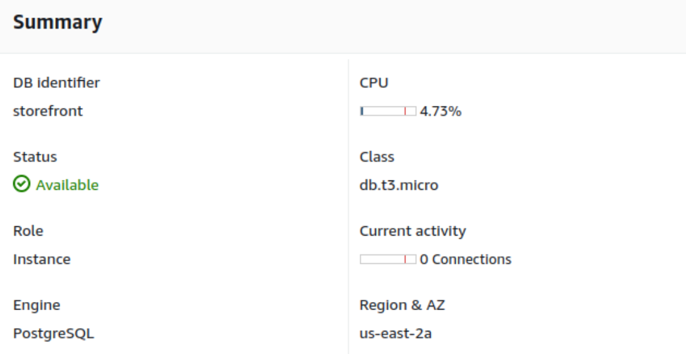
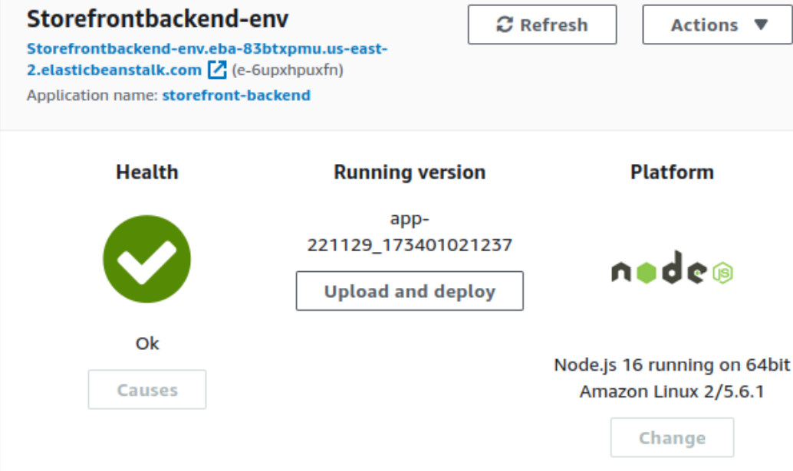
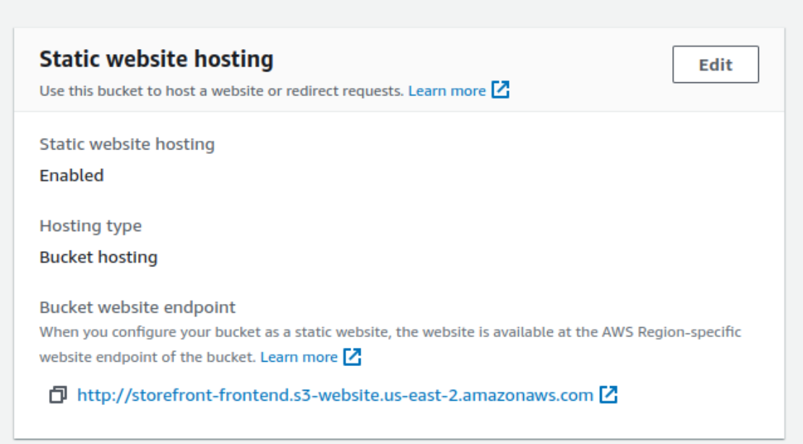
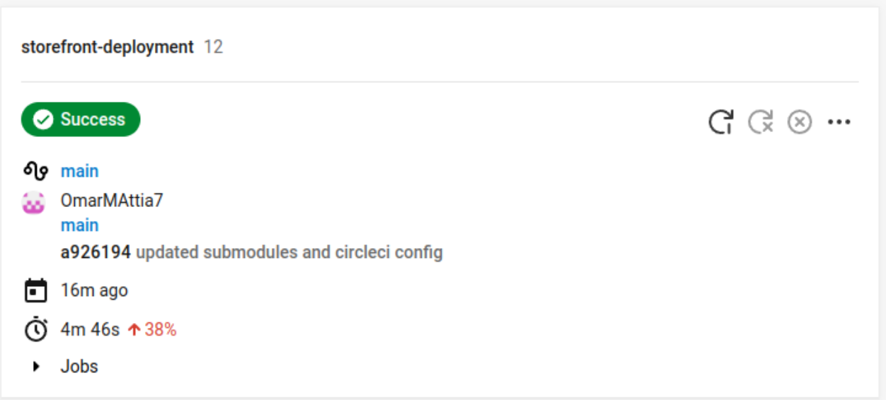
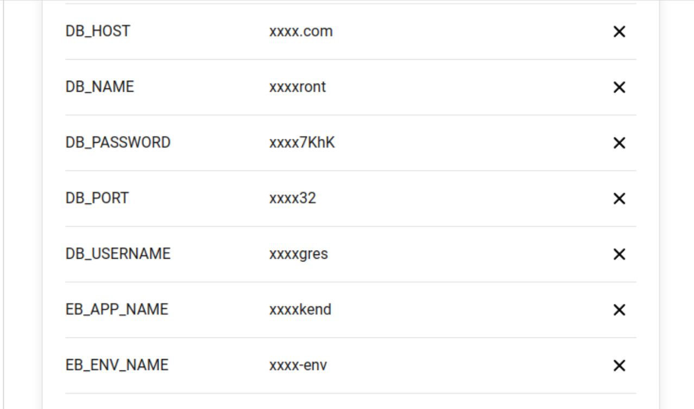

# CI/CD Deployment Project

Automated testing, building and deployment of a full-stack NodeJS application.
This was originally a submission for Udacity's Full-Stack Advanced Web Development Nanodegree's final project.

## Table of Contents

- [Links](#links)
- [AWS Screenshots](#aws-screenshots)
- [CircleCI Screenshots](#circleci-screenshots)
- [AWS Diagram](#aws-diagram)
- [Pipeline Diagram](#pipeline-diagram)
- [Docs](#docs)

## Links

The links for the Frontend and the API are no longer up, feel free to compile the application.

## AWS Screenshots

### RDS

### Elastic Beanstalk

### S3 Static Web Hosting

## CircleCI Screenshots

A screenshot of the last build.

A screenshot of the environment variables

## AWS Diagram

## Pipeline Diagram

## Docs

You can navigate to `/docs` for a more detailed written documentation.
