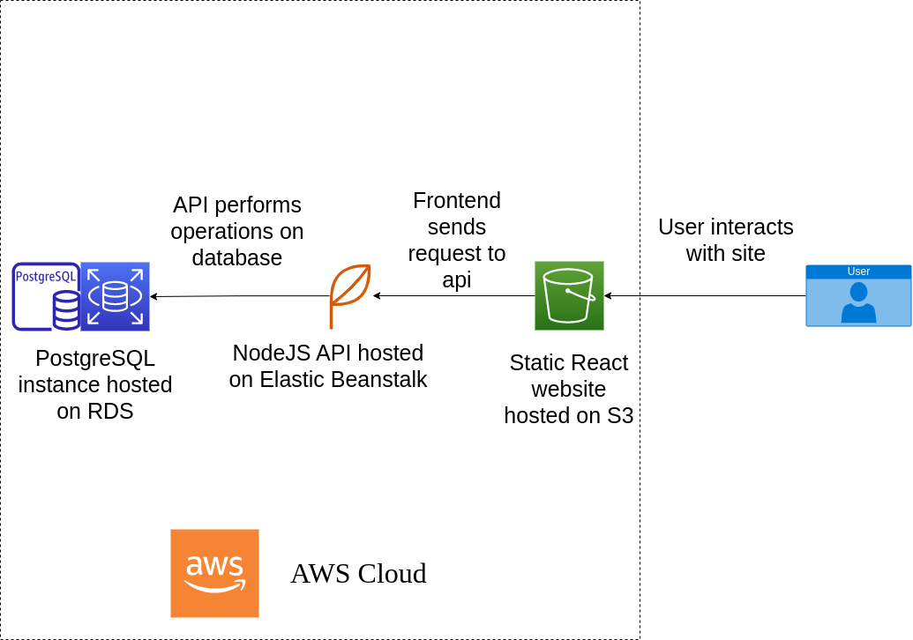

# Application Infrastructure

The application consists of two smaller apps, a [frontend application](#frontend), and a [backend API](#backend) that communicates with the [database](#database).

## Frontend

The frontend application is a ReactJS application bundled with Vite, and is hosted on an s3 bucket configured for static website hosting.

## Backend

The backend is a NodeJS/Express API hosted on an Elastic Beanstalk web server.

## Database

The database is a PostgreSQL database instance hosted on RDS.

