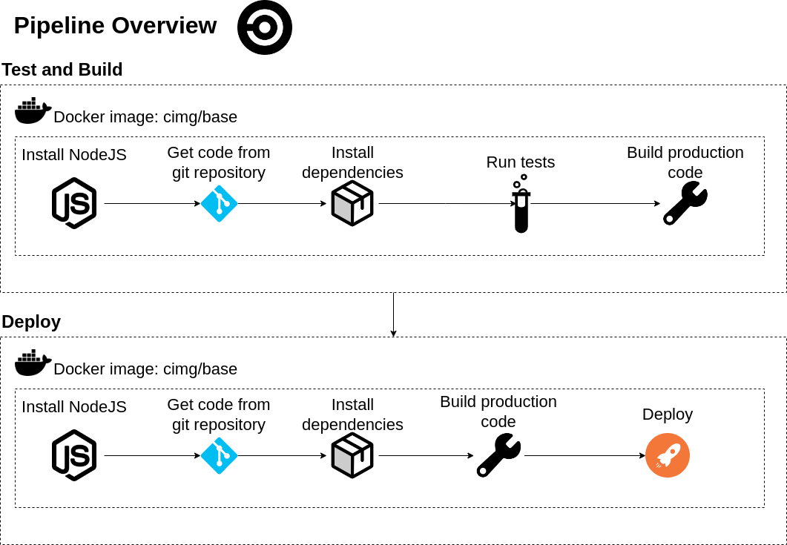

# The Pipeline

The pipeline is run with CircleCI and consists of two jobs:

- [Test and Build](#test-and-build)
- [Deploy](#deploy)

## Test and Build

- Create docker image
- Install NodeJS and Yarn
- Get source code and submodules from Git
- Install dependencies for backend and frontend
- Run tests for backend and frontend
- Build the application

## Deploy

Requires previous job to run and succeed first

- Create docker image
- Install NodeJS and Yarn
- Get source code and submodules from Git
- Install dependencies for backend and frontend
- Build the application
- Deploy the application

The difference between the jobs is that no tests are run in the deploy job and it needs the test and build job to run first

